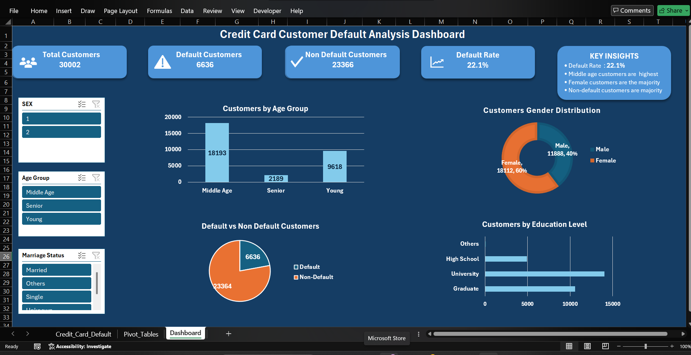

# Credit Card Customer Default Analysis Dashboard

## Project Overview
This project analyzes credit card customer default behavior using Microsoft Excel.

## Tools Used
- Microsoft Excel
- Pivot Tables
- Pivot Charts
- Slicers
- KPI Cards

## Dashboard Features
- Total Customers
- Default Customers
- Non-Default Customers
- Default Rate
- Customer Age Group Analysis
- Customer Gender Distribution
- Customer Education Analysis
- Interactive Slicers

## Key Insights
- Default Rate: 22.1%
- Middle Age customers are highest
- Female customers form the majority
- Non-default customers are the majority

## Dashboard Preview

